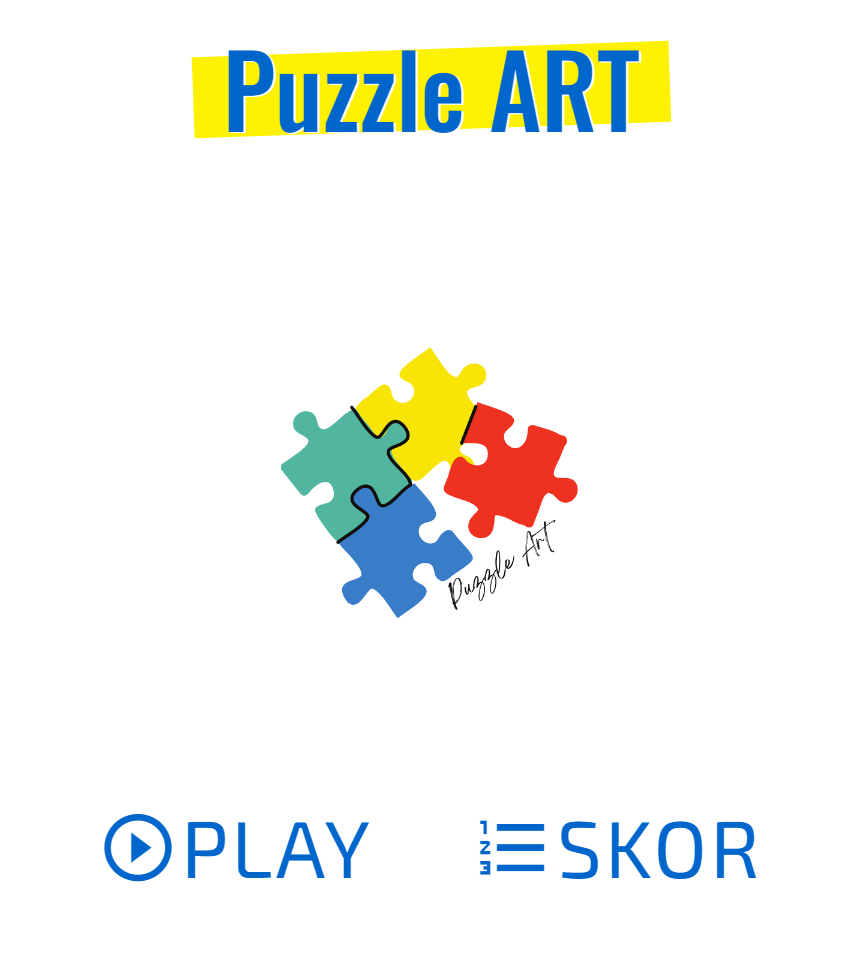
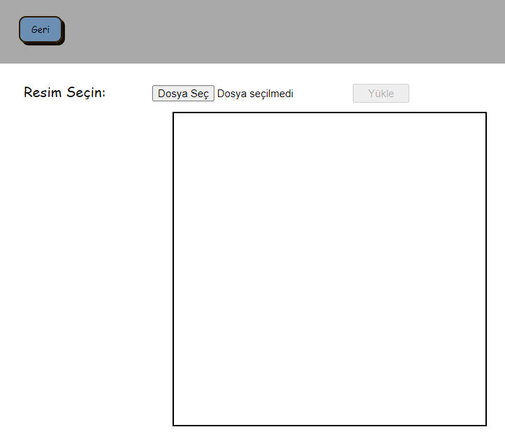
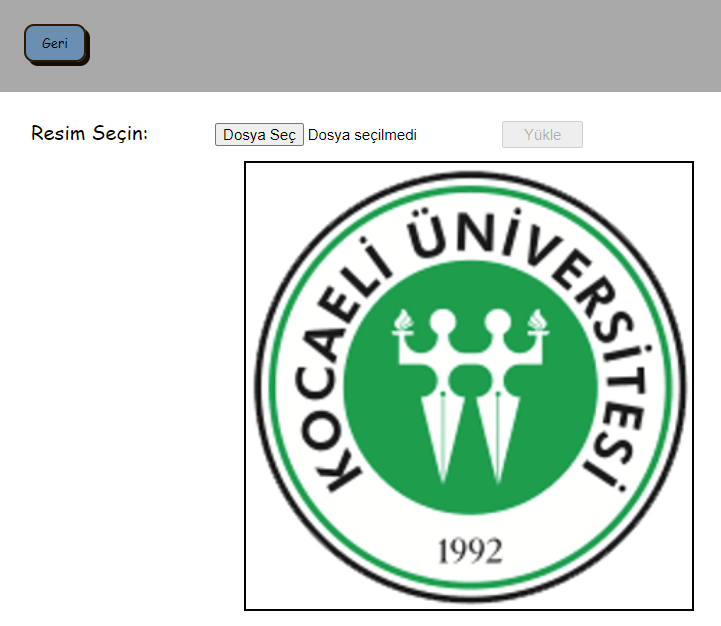
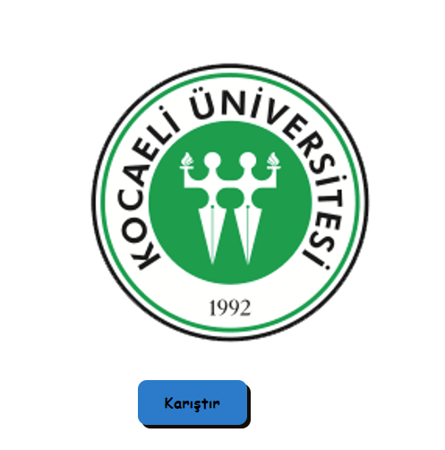
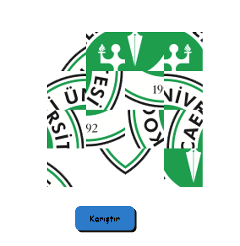
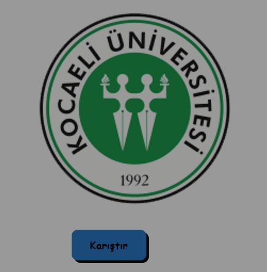
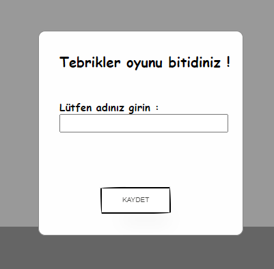

<a name="readme-top"></a>

<!-- PROJECT LOGO -->
<br />
<div align="center">
  <a href="#readme-top">
    
  </a>
</div>

<!-- TABLE OF CONTENTS -->
<details>
  <summary>Table of Contents</summary>
  <ol>
    <li>
      <a href="#about-the-project">About The Project</a>
      <ul>
        <li><a href="#built-with">Built With</a></li>
        <li><a href="#installments">Installments</a></li>
      </ul>
    </li>
    <li><a href="#usage">Usage</a></li>
    <li><a href="#contributing">Contributing</a></li>
    <li><a href="#license">License</a></li>
    <li><a href="#contact">Contact</a></li>
  </ol>
</details>

<!-- ABOUT THE PROJECT -->
## About The Project



This is a mandatory project of a Software Developing Laboratory-II class.

We are trying to do a puzzle game with user uploaded image which divided into sixteen parts and the parts are attached into buttons. Users swap buttons with each other by clicking on them and tries to swap back them to orginal form.

<p align="right">(<a href="#readme-top">back to top</a>)</p>

### Built With

These are what we used to develop our program:

* CSS
* HTML
* Node.js
* MongoDB

<p align="right">(<a href="#readme-top">back to top</a>)</p>

### Installments

* You need to install these packages.
   ```sh
   npm install image-to-slices
   ```
   ```sh
   npm install canvas
   ```
   ```sh
   npm install image-clipper
   ```
   ```sh
   npm install image-size --save
   ```
   ```sh
   npm install express
   ```
   ```sh
   npm install sharp
   ```
   ```sh
   npm install --save multer
   ```
   ```sh
   npm install buffer
   ```

<!-- USAGE EXAMPLES -->
## Usage

* User starts the game with "Oyna" button.

* Next user chooses an image from computer by clicking "Dosya Seç" button.

* Then user has to click "Yükle" button and now user sees the image.

* After that user clicks "Karıştır" button and game starts.

* This is the view when user clicks "Karıştır" button.

* When user ends swapping image parts to their correct locations by clicking on parts they wanted to change.

* Finally game ends, users write their names and their score saves in a folder.

* Users can see their saved score at main menu skor side.

<p align="right">(<a href="#readme-top">back to top</a>)</p>

<!-- CONTRIBUTING -->
## Contributing

The contributors of our project team:

1. Tuba Pınar Alataş: [https://github.com/pinaralatas](https://github.com/pinaralatas)
2. Can Ata Tekirdağlı: [https://github.com/canatatekirdagli](https://github.com/canatatekirdagli)
3. Kartal Yağız Deveci: [https://github.com/KartalYagizDeveci](https://github.com/KartalYagizDeveci)

<p align="right">(<a href="#readme-top">back to top</a>)</p>

<!-- LICENSE -->
## License

Distributed under the MIT License. See `LICENSE.txt` for more information.

<p align="right">(<a href="#readme-top">back to top</a>)</p>

